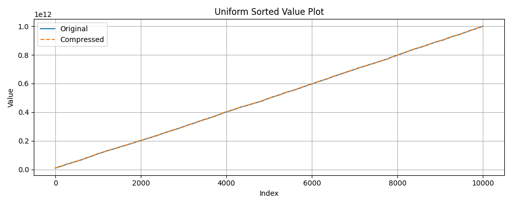
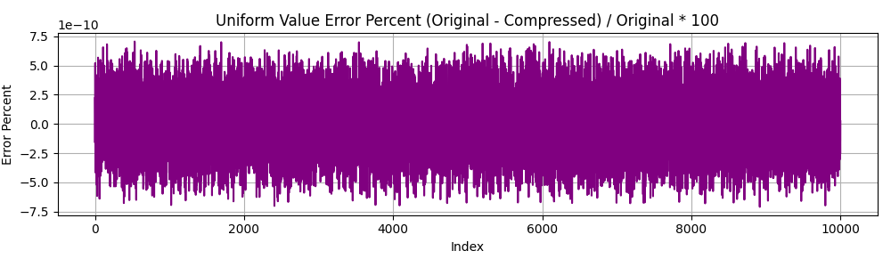
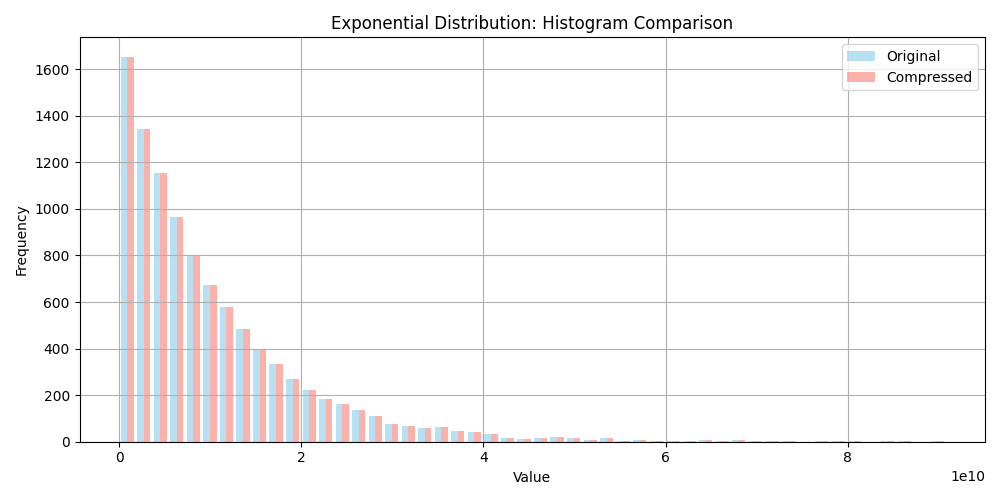
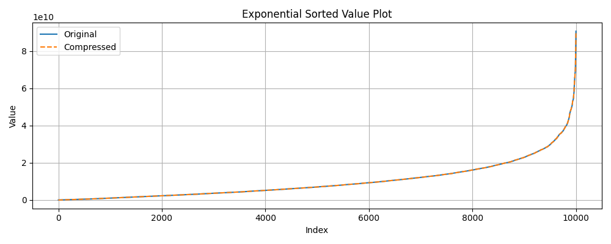

# Float Compression Results

## Configuration: keep_bits=48_round_off=True

### Algorithm: bitpacking

| Distribution | Original Size | Compressed Size | Compression % | R | MSE |
| ------------ | ------------- | --------------- | ------------- | --- | --- |
| Uniform | 80000 bytes | 60000 bytes | 75.00% | 1.33 | 2.825749e+00 |
| Gaussian | 80000 bytes | 60000 bytes | 75.00% | 1.33 | 9.260546e+00 |
| Exponential | 80000 bytes | 60000 bytes | 75.00% | 1.33 | 1.907266e-03 |

### Algorithm: gzip

| Distribution | Original Size | Compressed Size | Compression % | R | MSE |
| ------------ | ------------- | --------------- | ------------- | --- | --- |
| Uniform | 80000 bytes | 54684 bytes | 68.36% | 1.46 | 2.825749e+00 |
| Gaussian | 80000 bytes | 56035 bytes | 70.04% | 1.43 | 9.260546e+00 |
| Exponential | 80000 bytes | 56046 bytes | 70.06% | 1.43 | 1.907266e-03 |

### Algorithm: zlib

| Distribution | Original Size | Compressed Size | Compression % | R | MSE |
| ------------ | ------------- | --------------- | ------------- | --- | --- |
| Uniform | 80000 bytes | 54672 bytes | 68.34% | 1.46 | 2.825749e+00 |
| Gaussian | 80000 bytes | 56023 bytes | 70.03% | 1.43 | 9.260546e+00 |
| Exponential | 80000 bytes | 56034 bytes | 70.04% | 1.43 | 1.907266e-03 |

### Algorithm: lzma

| Distribution | Original Size | Compressed Size | Compression % | R | MSE |
| ------------ | ------------- | --------------- | ------------- | --- | --- |
| Uniform | 80000 bytes | 51056 bytes | 63.82% | 1.57 | 2.825749e+00 |
| Gaussian | 80000 bytes | 55808 bytes | 69.76% | 1.43 | 9.260546e+00 |
| Exponential | 80000 bytes | 54676 bytes | 68.34% | 1.46 | 1.907266e-03 |

### Algorithm: bz2

| Distribution | Original Size | Compressed Size | Compression % | R | MSE |
| ------------ | ------------- | --------------- | ------------- | --- | --- |
| Uniform | 80000 bytes | 54805 bytes | 68.51% | 1.46 | 2.825749e+00 |
| Gaussian | 80000 bytes | 56881 bytes | 71.10% | 1.41 | 9.260546e+00 |
| Exponential | 80000 bytes | 56091 bytes | 70.11% | 1.43 | 1.907266e-03 |

#### Plots

##### Uniform Distribution

##### Gaussian Distribution

##### Exponential Distribution

