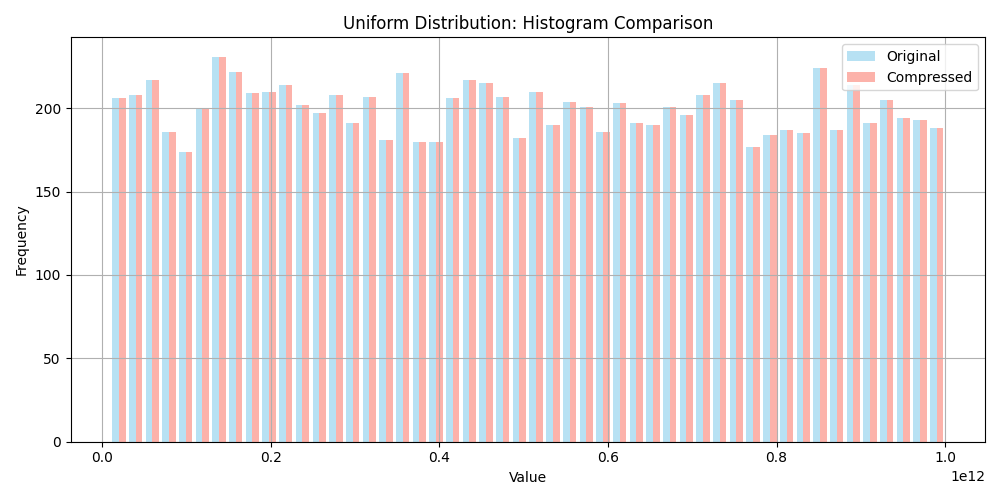
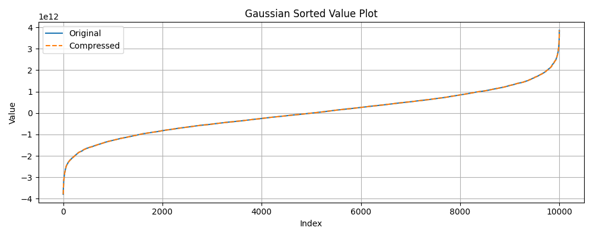
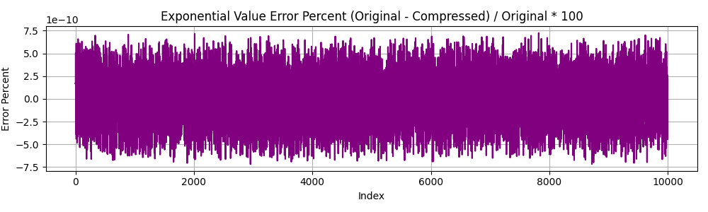

# Float Compression Results

## Configuration: keep_bits=48_round_off=True

### Algorithm: bitpacking

| Distribution | Original Size | Compressed Size | Compression % | R | MSE |
| ------------ | ------------- | --------------- | ------------- | --- | --- |
| Uniform | 80000 bytes | 60000 bytes | 75.00% | 1.33 | 2.791187e+00 |
| Gaussian | 80000 bytes | 60000 bytes | 75.00% | 1.33 | 9.698362e+00 |
| Exponential | 80000 bytes | 60000 bytes | 75.00% | 1.33 | 1.931051e-03 |

### Algorithm: gzip

| Distribution | Original Size | Compressed Size | Compression % | R | MSE |
| ------------ | ------------- | --------------- | ------------- | --- | --- |
| Uniform | 80000 bytes | 54679 bytes | 68.35% | 1.46 | 2.791187e+00 |
| Gaussian | 80000 bytes | 56058 bytes | 70.07% | 1.43 | 9.698362e+00 |
| Exponential | 80000 bytes | 56090 bytes | 70.11% | 1.43 | 1.931051e-03 |

### Algorithm: zlib

| Distribution | Original Size | Compressed Size | Compression % | R | MSE |
| ------------ | ------------- | --------------- | ------------- | --- | --- |
| Uniform | 80000 bytes | 54667 bytes | 68.33% | 1.46 | 2.791187e+00 |
| Gaussian | 80000 bytes | 56046 bytes | 70.06% | 1.43 | 9.698362e+00 |
| Exponential | 80000 bytes | 56078 bytes | 70.10% | 1.43 | 1.931051e-03 |

### Algorithm: lzma

| Distribution | Original Size | Compressed Size | Compression % | R | MSE |
| ------------ | ------------- | --------------- | ------------- | --- | --- |
| Uniform | 80000 bytes | 51088 bytes | 63.86% | 1.57 | 2.791187e+00 |
| Gaussian | 80000 bytes | 55324 bytes | 69.16% | 1.45 | 9.698362e+00 |
| Exponential | 80000 bytes | 55028 bytes | 68.78% | 1.45 | 1.931051e-03 |

### Algorithm: bz2

| Distribution | Original Size | Compressed Size | Compression % | R | MSE |
| ------------ | ------------- | --------------- | ------------- | --- | --- |
| Uniform | 80000 bytes | 54779 bytes | 68.47% | 1.46 | 2.791187e+00 |
| Gaussian | 80000 bytes | 56844 bytes | 71.06% | 1.41 | 9.698362e+00 |
| Exponential | 80000 bytes | 56094 bytes | 70.12% | 1.43 | 1.931051e-03 |

#### Plots

##### Uniform Distribution

##### Gaussian Distribution

##### Exponential Distribution

